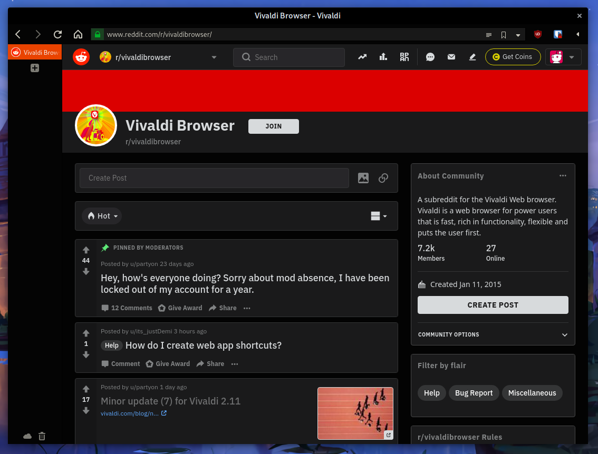

# Vivaldi customizations

My personal css modifications to better integrate Vivaldi in my desktop environment using the very space-efficient side tabs configuration.

## What this does

These customizations are meant to be used with __native windows__ and __side tabs__. It might work with tabs on the bottom, however this is untested.

To minimize wasted vertical space with native windows, it removes the header bar (rendering the vivaldi button or the horizontal menu only accessible via the F10 key).

It removes the use of the accent color in the address bar (I like to keep it in the tabs) so I can match my browser's background color with my native window titlecar color.

Minor modifications are made to the menubar buttons (circular highlight with fading added).

These customizations play really nicely with gnome and allows for the use of more features built-in your browser, such as hidden or combined address bars when maximized (unity-style) for minimal wasted space.

## Screenshots

Light theme configuration with Gnome:


Dark theme configuration with Gnome:


## How to use

Visit [](vivaldi://experiments) and tick the "Allow for CSS modifications" box.

Run as an administrator:
```
make apply
```
You might have to change the vivaldi directory in the Makefile.

Go to the vivaldi settings, in the "appearance" category and add the `css_mods` directory that was created in your vivaldi dierctory (typically `/opt/vivaldi/resouces/vivaldi`).
